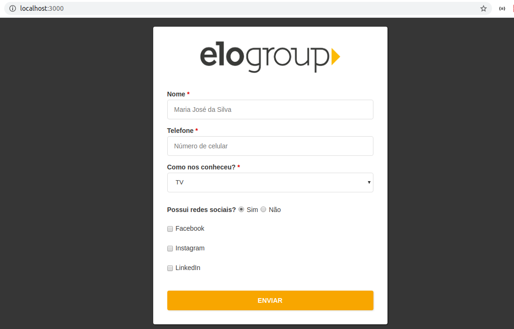

# Formulário EloGroup
_Ainda em desenvolvimento._

Esse formulário foi desenvolvido com [React](https://reactjs.org/) para a interface.

Outras bibliotecas usadas:
* [Yup](https://github.com/jquense/yup#yup) para validação.
* [Axios](https://github.com/axios/axios#axios) para comunicação com o backend.

### Dê uma olhada

Você vai precisar do [Node.js](https://nodejs.org/en/) e [npm](https://www.npmjs.com/get-npm) instalados em seu computador.

```sh
git clone https://github.com/yudi-azvd/elogroup-form # ou baixe clicando no botão verde desse repositório
cd elogroup-form

npm install
npm run start
```

### Ou ainda
Se, por acaso, a instalação dos pacotes demorar muito, você pode checar o funcionamento [aqui](https://elogroup-form.netlify.com/). O primeiro envio pode demorar até 40 segundos porque o backend está hospedado em um servidor grátis da Heroku.

### Está mais ou menos assim

<div style="margin: 0 auto;">
  
</div>

### Requisição POST
Para testar a requisição que é enviada pelo formulário, você pode usar o modelo encontrado
nesse [repositório](https://github.com/yudi-azvd/elogroup-form-backend).

### A fazer

* Input mask pra telefone (implementar ou usar uma lib? fazer pra nome também?)
* Estilizar checkbox e radio?
* Colocar animação Spin no botão enquanto estiver carregando (transformar em componente)
* Melhorar aparecimento das redes sociais